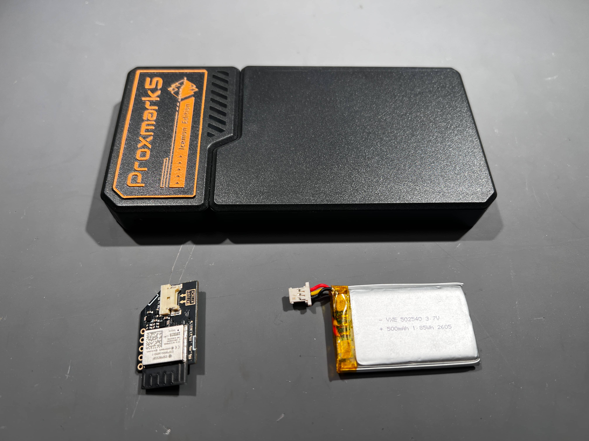
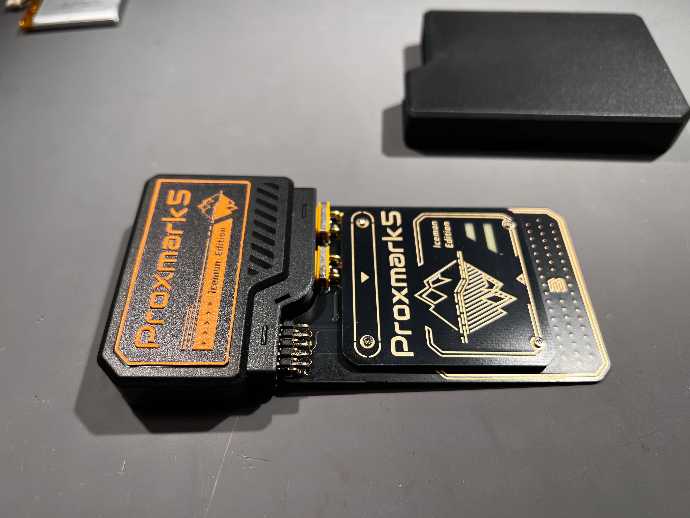
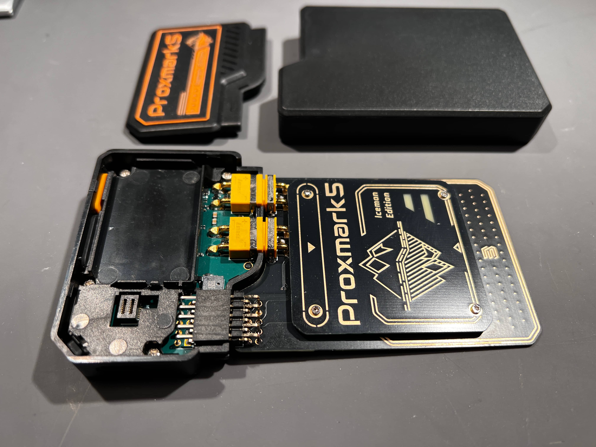
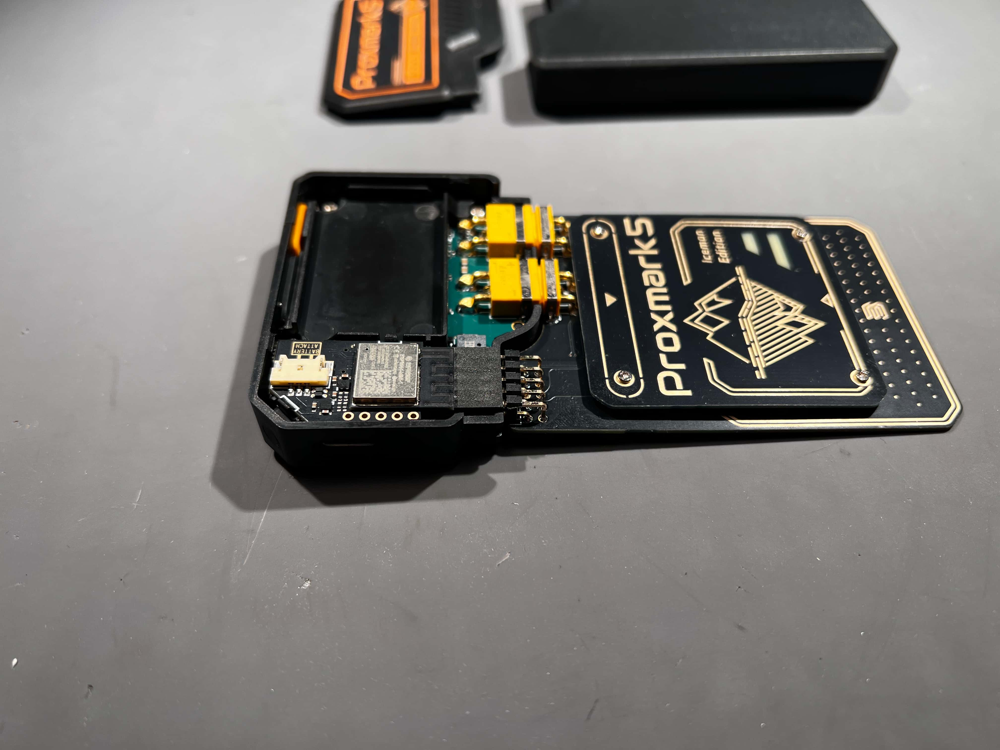
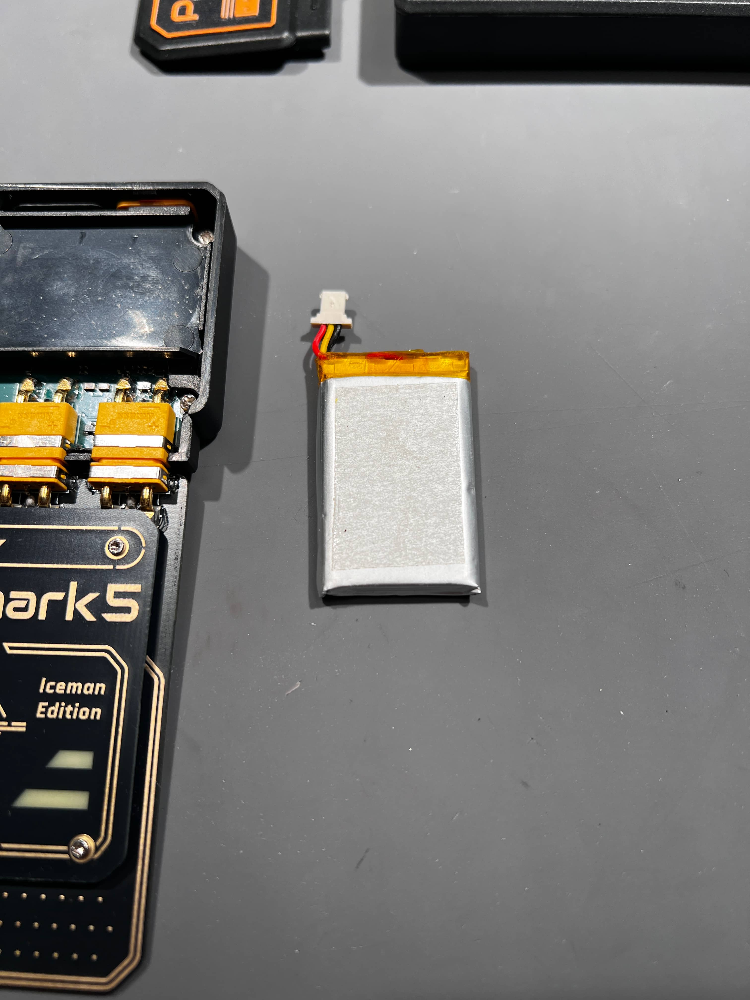
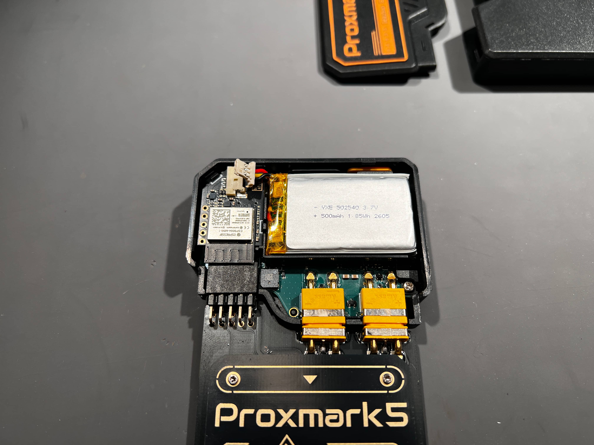
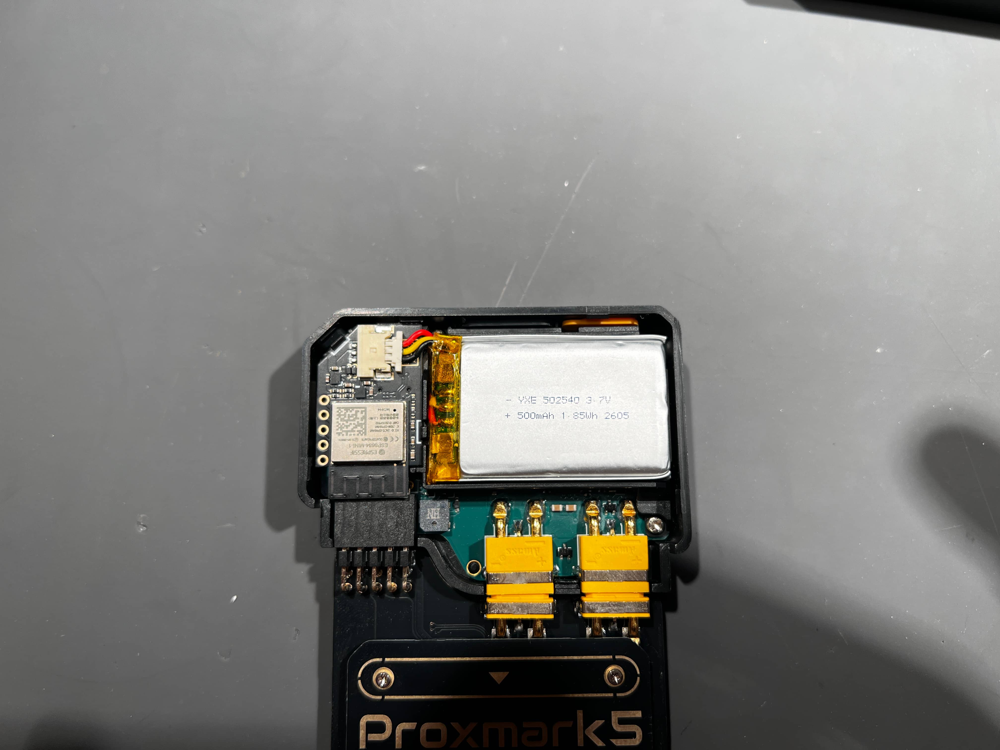
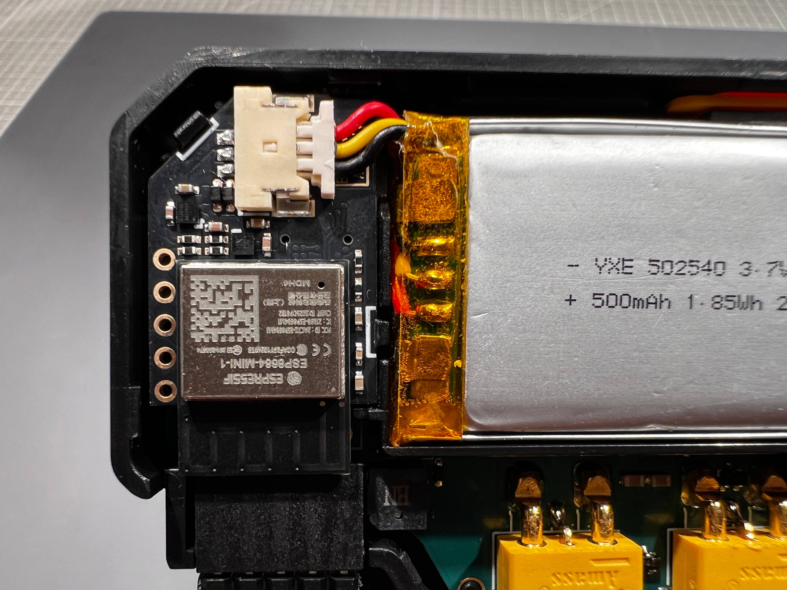

# Proxmark5 BWM Installation Guide

1. Prepare the PM5 host, the accessory board, and the lithium battery.

2. Pull the antenna cover of the PM5 host outward.

3. Lift the upper decorative cover of the PM5 host. It is secured by a row of clips and can be removed easily with a flat tool or a fingernail.

4. Install the small circuit board from the kit into the reserved slot on the PM5 host. Apply steady vertical pressure to avoid damaging the connector. Once the board is fully seated and locked by the two clips, the installation is complete.

5. Remove the protective backing paper from the double-sided adhesive on the back of the lithium battery.

6. Attach the lithium battery to the designated position on the PM5 host. Make sure the power connector is placed on the outside so that it does not press against the cable.

7. Connect the battery connector to the matching connector on the small circuit board.

8. The image below shows the connector in its correctly installed state.

9. Press the PM5 power button. The indicator light should turn on to confirm that the device has powered on. If it does not light up, try briefly charging the PM5 through the Type-C port to wake the battery.

10. After confirming that the device is operating normally, reinstall the two plastic covers that were removed earlier.

# How to Shut Down the Proxmark5 Device

In the current Proxmark5 firmware implementation, press and hold the power button until the LED begins to show a running pattern, then release the button to shut the device down.
