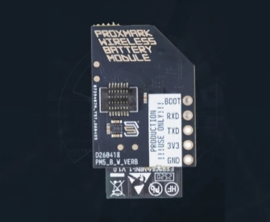

# Proxmark5 Battery Wireless Module

This board integrates an ESP32-C2, a coulomb counter IC, and a charger IC to provide the Proxmark5 with wireless connectivity and safe, efficient battery charging and power management.

## Key Components

- ES8684: Wi-Fi 4 and Bluetooth 5 (LE)
- BQ27427YZFR: A high-efficiency lithium battery fuel gauge from Texas Instruments that reports remaining capacity, state of charge, and battery health
- AW32001ECSR: A lithium battery charger that manages charge and discharge parameters, power-path control, and full battery safety protection

## Interface Functions

- BTB_10P: Power path, UART, and I2C
- HEADER_5P: Debugging and firmware flashing interface

## Hardware Design

Refer to the schematic: [Proxmark5 BWM SCH](./SCH.pdf)

# Installation on Proxmark5

Please follow the installation guide: [How to install BWM on Proxmark5](./INSTALL.md)

# BWM Development

We sincerely appreciate your interest in contributing to this firmware repository. Before modifying the firmware or submitting a pull request, please review the following development guidelines.

1. The main component should not implement overly complex communication protocols. Its role is to integrate the available components and dispatch work through callbacks triggered by system events.
2. Keep components as independent as possible unless they are explicitly designed for shared reuse across modules.
3. When adding new commands, consider their scope carefully. For example, Bluetooth-related command codes begin at 4000.
4. Do not change the order of existing commands or insert new commands into the middle of the command list, as this may break compatibility with older firmware.
5. Use four spaces instead of tabs.

Thank you for reviewing these guidelines. You may now proceed to the development documentation: [View Dev Docs](./DEV.md)

> If you need to reference hardware documentation during development, please review the sections above.
